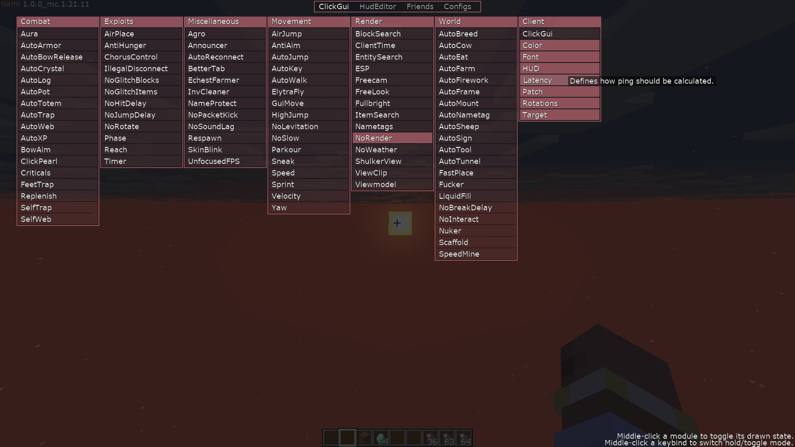
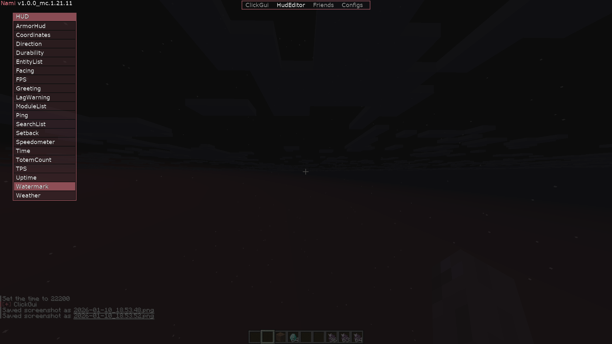
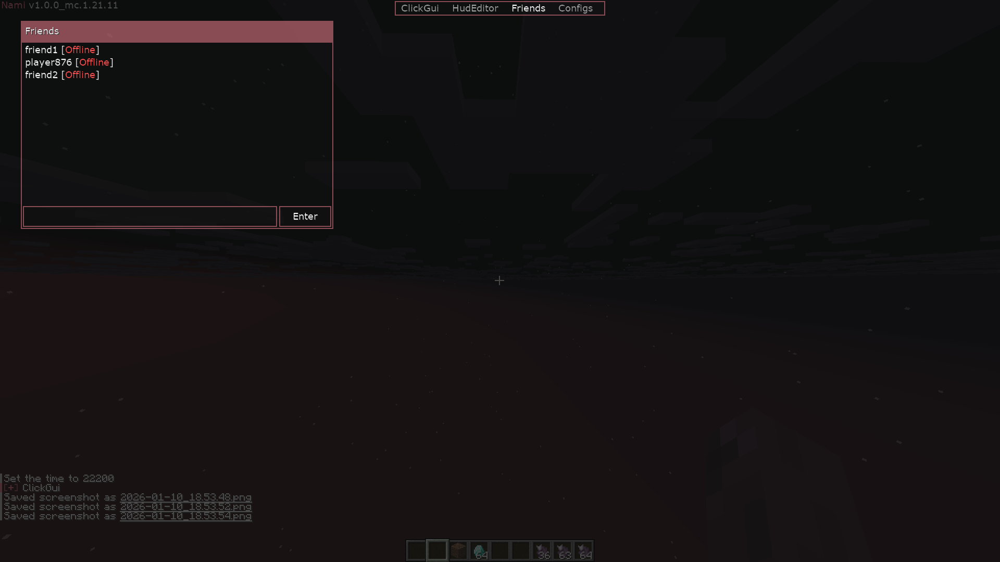
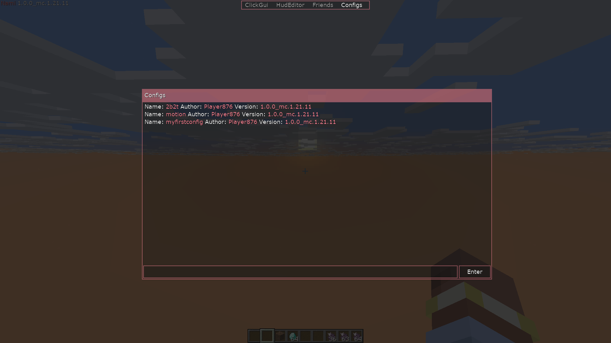

# Nami

1.21.11

### Join our discord - https://discord.gg/auHTtNAqRq

<p>
  <a href="https://github.com/NamiDevelopment/nami/releases">
    
  </a>
  <a href="https://github.com/NamiDevelopment/nami/commits">
  
  </a>
  <a href="https://github.com/NamiDevelopment/nami/releases">
    
  </a>
  <a href="https://discord.gg/auHTtNAqRq">
    
  </a>
</p>


**Nami** is a modular and lightweight anarchy client base built for PVE and automation.  

Most popular Minecraft clients are closed-source, paid, and obfuscated, making them difficult to audit or trust. Some may include backdoors or malicious code.

This project started as a clean, open-source alternative aiming to be transparent, secure, and easy to extend without relying on unsafe third-party clients.

---

## Screenshots

<details>
<summary>View screenshots</summary>






</details>

---

## Plugin development

See https://github.com/NamiDevelopment/template-plugin for information

---

## FAQ

<details>
<summary>How to open ClickGUI?</summary>

Default keybind is: P  

</details>

<details>
<summary>What is the command prefix?</summary>

The default command prefix is `-`.

</details>

---

## Requirements

- Java 21  
- Gradle 8+  
- Minecraft 1.21.11 
- Fabric loader, API

---

## How to Build

1. Clone the repository:

    ```sh
    git clone https://github.com/NamiDevelopment/Nami.git  
    cd nami
    ```
2. Build with Gradle:

    ```sh
    ./gradlew build
    ```

The compiled JAR will be located at:  
`./<project>/build/libs/nami-<version>.jar`

nami-client is packaged with nami-api inside of it.

---

## License

This project is licensed under the MIT License. You are free to contribute, distribute, fork, or reuse any part.

---

## Special Thanks

- [cattyngmd](https://github.com/cattyngmd)

- [CatFormat](https://github.com/cattyngmd/CatFormat)
